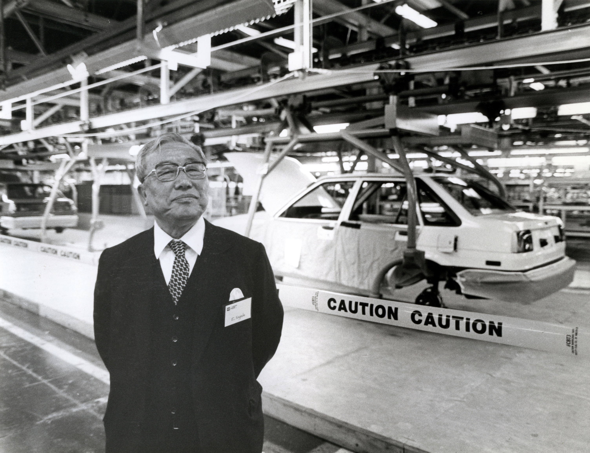

# トヨタに学ぶ 「滅びる組織」「伸びる組織」 売れ続ける秘密は「SHUSA」にあり！

> 1953年に主査制度を築いた豊田英二氏

知らないのは日本人だけ？―なぜトヨタは世界で売れ続けるのか。

それは「トヨタ生産方式」が利益を生み出しているのではなく、秘密は「主査制度」にあった。アメリカ企業が徹底研究して、次々とイノベーションを起こす源流は日本にあったのだ！

「ダメじゃないですか」

リストラについての相談を受けているとき、酒井崇男は思わずそう口にした。人事・組織関係のコンサルティング「グローバル・ピープル・ソリューションズ」の代表取締役を務める彼は、リーマンショック前後からリストラの相談を受けることが増えた。大半はメーカーなどの研究職。一流企業の有能な技術系エリートばかりだ。ところが、面談中、酒井が研究について聞くと、しばしばこんな答えが返ってくるのだ。「研究の用途？それはわかりませんよ」―信じがたいことに、彼らには売れるものをつくるという目的がスッポリと抜け落ちているのだ。

自身も東大大学院で工学系を修了し、大手企業の研究職にいた酒井は、こう話す。「価値を生むビジネスプロセスは、企画の段階から販売まで繋がっていなければならないのに、分断されているのです。研究者は技術だけを磨いていれば出世できると信じてきたため、世の中に価値あるものを提供するよりも、社内の秩序や自分たちの存在価値を優先している。せっかくの才能が機能していません。こうした企業は結構多く、最終的にみんなで船を沈ませている。私はこれを“和をもって倒産する”と呼んでいます」

リストラされる有能な人々を次々と面談するうちに、酒井は「こりゃ、大変なことになる」と危惧した。日本にあふれた才能が、社内で腐ったまま大量の失業者に変わり果てていくからだ。

企業は優秀な人材を集めながら、なぜ消費者の期待を超える価値を生み出せないのか。世界を変えたアップルやグーグルと何が違うのだろう。その仕組みを解き明かすために、彼は研究結果を上梓した。『「タレント」の時代　世界で勝ち続ける企業の人材戦略論』（講談社現代新書）だ。このなかで酒井が注目したのが、アメリカが徹底研究した「SHUSA」である。これはトヨタの「主査制度」のことだ。日本では一般的に知られていない。「多くの企業が導入しているのは、有名な『トヨタ生産方式』の方です。しかし、トヨタ生産方式がヒット商品を生むわけではなく、これは工場生産の効率化が目的です。実際に利益の95％を決めているのは設計情報を創造している開発段階。この段階で、人々が欲しがるような魅力的な車かどうかが決まる。売れ続ける商品をつくりだして利益をもたらすのは、トヨタ生産方式ではなく、トヨタの開発の仕組みなのです」

ここに注目したのがアメリカだったのだ。
トヨタの主査（チーフエンジニア）とは、担当する車に関して「すべての事柄」に責任をもつポジションだ。カローラ、セルシオ、クラウンなどそれぞれに主査がいて、市場の情報から競合情報、コンセプト、開発まで統括するチームの司令塔である。1953年に主査制度を築いた豊田英二（上記写真）はこう述べているという。「主査は製品の社長であり、社長は主査の助っ人である」
大企業の社長と同等の責任をもち、主査の組織はラインではなく、オーケストラに近い。主査は指揮者で、各部署と連携し、メンバーの能力を最大限に引き出す。分析、タイムリーな指示、統合の能力をもち、これを酒井は「プロフェッショナル」ではなく、「タレント」と呼ぶ。タレントは「価値を生み出す人」でなければならない。また、「主査は同じ会社で同じ釜の飯を食っているため、どの車種のどの技術者がどのくらいの技量をもっているか、加減がわかります。『ああ、シャシーの○○か』といった具合に、タレントを見抜けるタレントが主査となっているのです」
主査という打席に立ってヒットを打てなければ、主査には誰もつかなくなり、自然と立場を失っていく。価値を生まないもの、無駄なものはこうして排されていくのだ。酒井が言う。「83年にトヨタとGMは合弁会社NUMMIを設立し、豊田市にも大勢のアメリカ人がやってきました。70年代にものづくりで日本に負けたアメリカは、そこでトヨタの本質を見抜き、学習したのです。彼らはアメリカに帰り、それはシリコンバレーに伝播して、主査制度に金融が結びつき、エコシステムが完成したのです」
スティーブ・ジョブズが開発の中心として主査の役割を果たしたのが「iPhone」であり、その源流はもともとトヨタにあったのだ。さらにルーツを遡ると、日本の戦闘機に辿り着く。初代カローラの主査・長谷川龍雄（のちの専務）は、戦前、立川飛行機で戦闘機の開発を行っていた。「航空工学は、機械、電気、制御、流体、材料加工技術などバラバラの専門技術を統合することが必要とされ、そうして戦闘機というシステムを開発します。コンピュータシミュレーションができない時代に、航空技術者たちは広く深い知識、地頭力や洞察力を持ち合わせていました。ここに目をつけたのが、トヨタの創業者である豊田喜一郎です。将来を見越した喜一郎は、航空技術者を大量採用し、日本最高峰のタレントを獲得したのです」
飛行機の組織構造を自動車に持ち込んだわけだが、驚いたのは徹底研究したアメリカの人々だ。てっきりトヨタだけでなく、家電メーカーなど日本の企業は「SHUSA」制度を駆使していると思い込んでいた。ところが、日本で主査制度を取り入れている企業が見当たらないのだ。
トヨタの人たちも「○○社の主査って、どんな人がやっているんだろう」と口にして、「いない？　そんなバカな」と不思議がったという。

酒井が言う。「自動車業界には主査に近い仕組みがありますが、トヨタは終身雇用なので、他の業界にまで広がることがなかった。つまり、三河の常識は日本の非常識になってしまったのです」
そのうち電機やIT分野でアメリカが隆盛を極め、日本の企業はアメリカ企業に後塵を拝してしまった。さらに日本の税金で教育を受けた有能な若者は、アメリカの企業に就職するようになり、一方で日本の企業に就職した才能ある若者は、冒頭のエピソードのように能力を引き出してくれるタレントと出会うことなく失業者となっている。「基礎学力が高い日本は、実はタレントの宝庫です」と、酒井は言う。「だからこそ、知識や才能を利益に変える組織づくりをトヨタ以外にも広める必要があるのです」

つまり、消費者に価値あるものを提供できるヒントは、人材を活用できる仕組みづくりにあるのだ。逆に、滅びる組織にはパターンがある。酒井が言う。「顧客より内部の秩序維持を優先したり、アメリカの金融企業のように資本の効率性を見る経営手法を、ソニーなどクリエイティブ企業が取り入れると失敗します。ソニーはタレントの集団であり、財務諸表には載らない価値創造の現場に意味があるのです」
