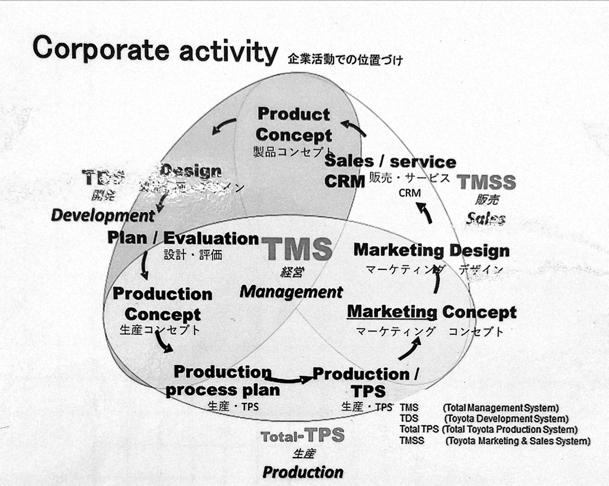
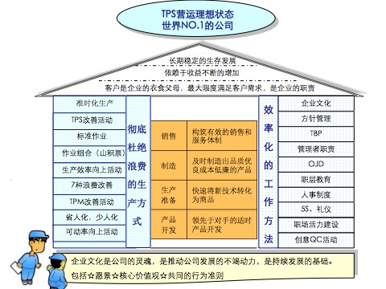
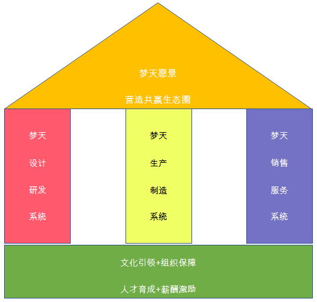
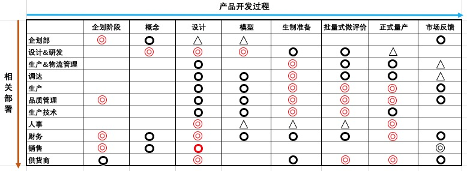

---
toc:
  depth_from: 1
  depth_to: 3
  ordered: false
export_on_save:
  html: true
html:
  offline: false
---

# 梦天集团经营变革服务思路 {ignore=true}

吴鸿远

---

[TOC]

@import "./my-style.less"

## 一、愿景解析

### 1. 梦天愿景

#### 营造共赢生态圈 {ignore=ture}

- 建立全业务流程的行业标准
- 重新定义产业链生态的价值流动

#### 做一流家居企业 {ignore=ture}

- 从木门到木作的产品服务战略转型（制造技术&管理技术的柔性）

### 2.愿景实现的理想状态

### 3.理想状态的基础构成

为了实现愿景，企业必须具备从**研发设计-生产制造-市场销售**的完美闭环。

> 制造技术和管理技术的完美统一

## 二、现状把握

### 外部环境

> 需权威行业研究报告&梦天相关业务数据支持

  1. 市场增速整体下滑
  1. 消费者喜好的变化
  1. 行业品牌一体化的趋势（整体家装-一站式服务）
  1. 行业技术的升级
  1. 政策法规的变化（环保节能）

### 内部环境

> 基于前几次沟通交流把握的问题点

设计研发-生产制造-销售服务的协作分散割裂，导致异常频发；

### 余董想法

#### 基于愿景：

1. 输出行业标准，打通类似麦当劳的全流程标准化体系；
1. 建立公司-股东-员工和公司-伙伴（地产、经销商、供应链）的共荣共赢大平台；

#### 基于环境：

- 外部环境：把握变化-跟上变化-引领变化
- 内部环境：以人才成长为核心的柔性

## 三、太和整体解决方案

### 方法论来源

丰田全面经营管理系统的架构

### 梦天整体解决方案架构1.0

基于梦天的愿景与现状，提出==梦天整体解决方案架构==`1.0`版本

#### 架构方案解析

基于当前与梦天团队沟通交流获取的信息，在愿景统一之后（下一步应该是全员宣贯），方针推进（两个维度：公司方针到部课到班组的方针&中长期到年度到季度月度的方针）之前，首先必须进行公司经营系统的全业务流程梳理，主要包括如下三个方面：

##### 市场定位

> 销售服务系统 & 设计研发系统的协作

类似于丰田主打车型的分类，具体在天津/广州/长春/成都四个工厂生产哪些车型。这就需要梦天经营层达成一致，木作的产品分类要定为几种，每种又分别有哪些种类，每类应该有什么样的标准。如果这一步没有设计好，会重新陷入当前为了定制而问题百出的恶性循环。

##### 全流程梳理

> 从客户-设计研发-生产制造-销售服务的循环

比如从设计研发的角度，究竟要主推哪些品类，应该来源于市场营销的数据和分析，那么市场营销需要哪些数据才能支持设计研发部门做好产品分类。相应的业务流程应该是什么？如何打通？

##### 标准确定

在第一步第二步实现后，每个流程相应的作业标准（做什么？为什么要做？谁做？什么时候做？做到什么程度？怎么做？）都需要确立，这是未来建立全价值链标准的第一步，可以不完美，但必须有。

##### MSS-MDS-MPS系统的四大基础

- [x] 组织机构的优化（含岗位职责和作业标准）
- [x] 薪酬考核的优化（含薪酬考核与改善机制）
- [x] 人才育成的优化（含要员规划和人才梯队）
- [x] 文化引领的持续（含公司使命价值观的建立优化）

## 四、当前业务开展与未来跟进的必要考虑

全业务流程的梳理需要战略的定力与耐力，需要全系统全团队的参与验证，但是还需要回到现实，在当前公司日常业务开展中的问题都有哪些，如何解决。这里还必须回到原点，即为了实现愿景，我们需要有什么样的支撑（制造技术和管理技术分别要达到什么水平）？

就是MDS-MPS-MSS的打造和循环。

### 生产是根基

> 嘉善项目&庆元项目

基于当前了解的问题，首要瓶颈在生产，正如丰田始终强调TPS是以制造现场为核心的全员的DNA，梦天打铁还需自身硬的体现也是首先在生产系统。换个角度，我们能生产什么？能达到什么样的品质？能以多小的成本生产出来？能以多快的速度交付？这些核心要素决定了梦天经营业务变革有多大的底气和实力。木门也好，木作也好，如果生产跟不上，一切都是空谈。

正因为如此，我们当前选择在生产系统四个试点线进行MPS的建立，这一步必须坚定不移地走下去，一直到嘉善庆元都能像丰田天津广州工厂一样，永远充满自信地对接日本丰田总部的新车型（换个角度，正是因为天津广州工厂的卓越，日本总部也优先考虑新车型交给这两家工厂制造）。

### 上下道序的协作与自工程完结

通过青田店大部屋的梳理，暴露出来当前业务流程的第二个瓶颈为设计研发。按照理想的“协作式工作推进”，我们有不少差距。以丰田为例：

梦天未来的设计研发体系应该如何建立？设计研发部门内部的作业流程和标准是什么？对其它部门有什么需要？

我们认为这是第二个要重点关注的瓶颈。虽然当前青田店的交付暴露出来的很多问题是因为设计研发先期工作准备不充分造成的，但本质上并非某一个部门的问题，而是大家都缺乏协同作战的意识和方法，在生产系统已经开始优化的基础上，选择设计研发开始，不仅有利于公司短期目标（快速交付快速开店）的实现，更有利于业务流程的梳理再造，最终促进公司愿景的达成。

### 全价值流的业务联动

- 基于当前我们的营销体系（渠道和精装），我们最终服务的群体是谁？
- 如何把相关群体再细分，变成我们经营规划的决策依据，引领设计研发到生产技术的变革？
- 为了实现这个目标，当前在营销企划，营销管理，安装维修相关的人机料法环有哪些可以进一步改善的切入点？
- 如何通过点到面的改善最终打造出“以客户为中心”的梦天价值流（麦当劳似的快速复制快速盈利）？

### 梦天经营发展白皮书

经营体系变革&经营者育成

通过一期三大支柱（MDS-MPS-MSS）的梳理和建立，逐步建立梦天发展白皮书，主要包括如下方面：

- [x] 梦天经营指南
- [x] 迎接创业30周年
- [x] 不变的重要基本思想（基本方针，社训）（传承思想）
- [x] 被精炼成熟的中心思想（经营理念）
- [x] 为了什么经营?(经营的目的)
- [x] 为了达成经营目的的基本思想
- [x] 董事长（用这样的信念创立了公司）（下一代的继承）
- [x] 总经理（像打造这样的公司）（今后的抱负）
- [x] V2025中长期经营计划书  5年愿景・技术发展蓝图
- [x] 2018年度的反省和2019年度的公司方针
- [x] 2019年度的集团活动方针的展开
- [x] 2019年度公司组织体系图
- [x] 方针展开（方针管理体系，会议体系一览）
- [x] 2019年度 公司日历
- [x] 为了达成目标梦天的企业行动规范
- [x] 员工（自己理念和表明决心）

### 梦天经营发展四大保障

>文化、组织、人才、绩效

#### 组织机制优化

基于三大支柱（MDS-MPS-MSS）的完成进度，预计2020.3启动

#### 人才梯队建设

由MPS系统切入，预计2019年四季度启动

#### 绩效体系优化

基于三大支柱（MDS-MPS-MSS）的完成进度，预计2020.3启动

#### 文化驱动

与**全价值流的业务联动**、**经营发展白皮书**同步

---

以上
