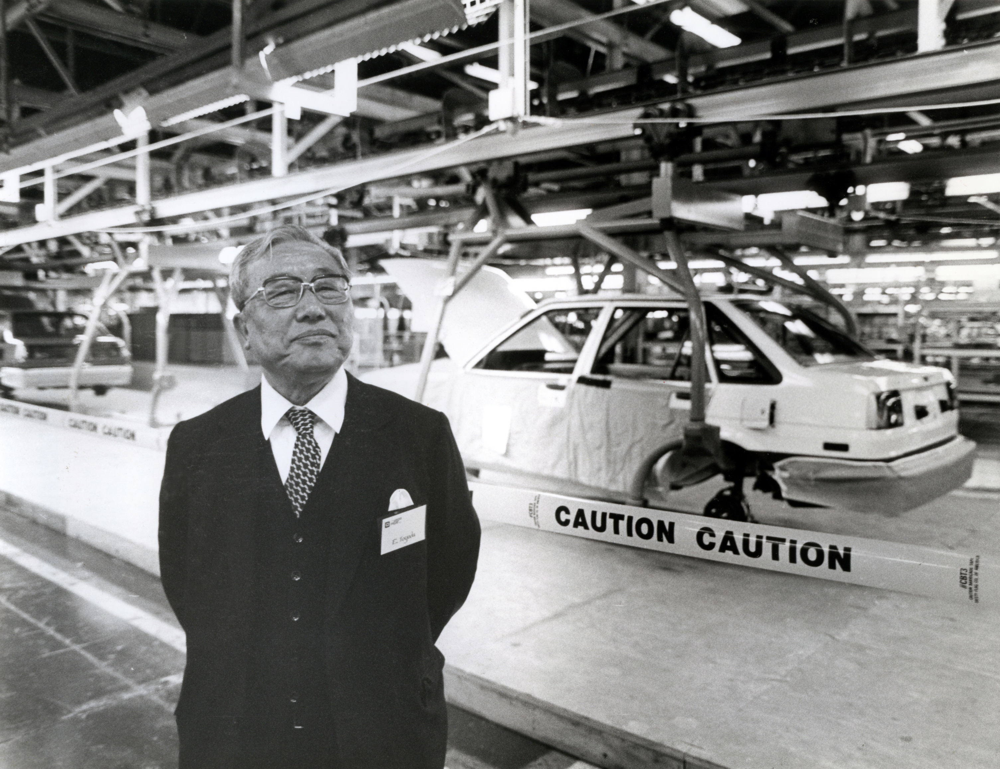

# CE制度简介

> **CE制度**，又称**车辆主查制度**，是由已故前丰田公司领导人**丰田英二**创立。

丰田英二 翁 

## 相关背景

在丰田汽车公司内，CE是具备整合**技术和社会（包括商业）技能**的个人。

* CE所在部署叫**Z部门**，自2011年起，Z部门直辖于**制品企划本部**

* **制品企划本部**与其他类似**本部**[^1]级别相同

* CE直接向**本部长及以上层级**汇报

* 不是**所有**车型（或产品）都配备有CE

[^1]: 其他本部例如：技术管理本部、Design本部、第1技术开发本部等。

## 作用要求

### 作用职责

CE是代表客户，向公司提出其对**产品**，乃至于**对公司的愿景**。

CE思考并决定**其负责产品**的以下方面，并对产品全过程负责。

* 商品力
* 成本
* 合规性
* 产品技术
* 生产技术

### 资格要求

本质上CE是**车辆主查**（SHUSA）。

原则上，职级至少为**基干1**[^10][^11]以上。

[^10]: 丰田的职级制度在2018年有过重大变化，此为变化之前的称呼。

[^11]: 其上为各本部的本部长，再之上为公司各领域的领域长或副总经理等经营层。
<!-- 
> CE只能通过渊博的知识、提出好的想法、专业地谈判技巧、必须优先推进的事项和愿望，以及非常强大沟通能力来实现真正的领导技能，而不是依靠公司赋予他们的权力来实现其在组织结构图上的位置 -->

*以上*
