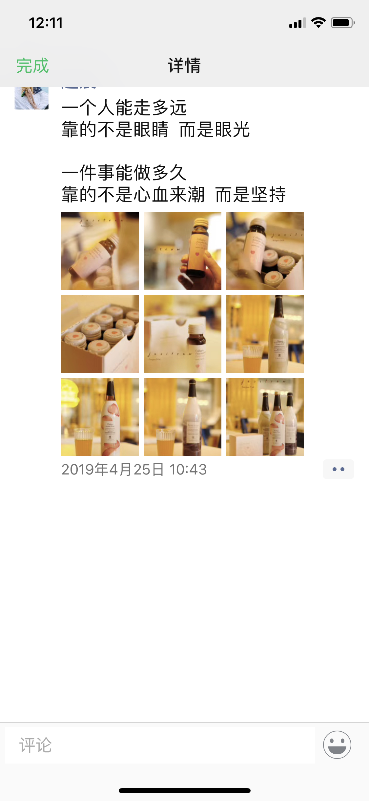
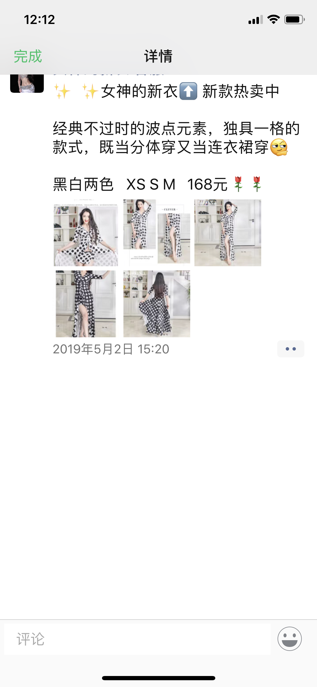
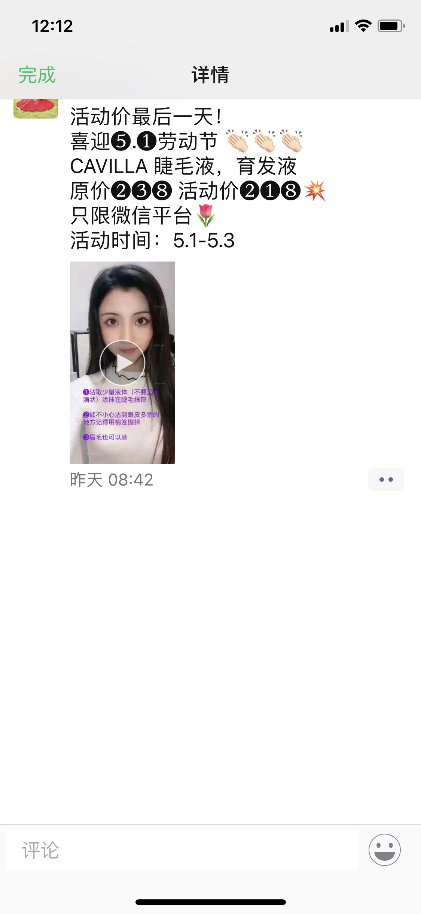
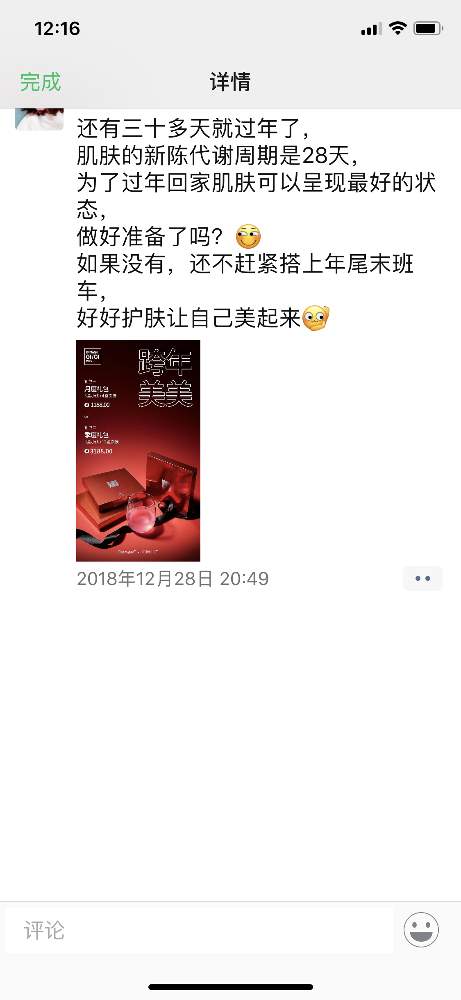
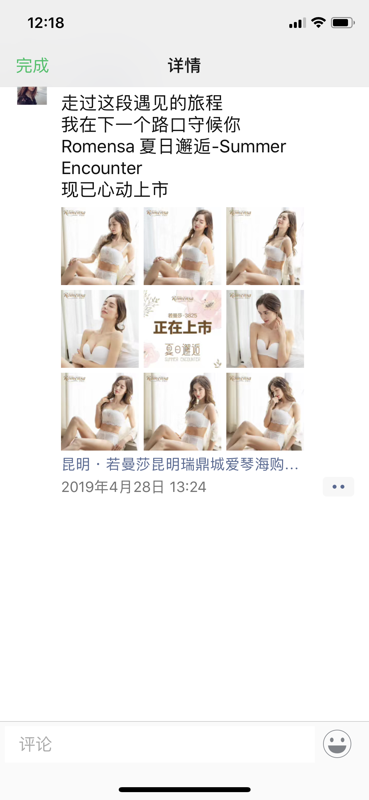

# 国内网络营销浅见

---

## 一、网络营销的主要方式

1. 淘宝店铺
2. 微店交易
3. 朋友圈、微信直接交易

|类型|宣传效果|交易 正规程度|订单管理|申请 简便程度|资金流转|
|:---:|:---:|:---:|:---:|:---:|:---:|
|淘宝 店铺交易|3|5|5|3|5|
|微店交易|3|4|4|4|5|
|朋友圈、微信交易|5|3|3|5|3|

综上建议：使用最快速的打开网络市场的方式，即朋友圈营销+微信直接交易+微店交易。

用朋友圈快速宣传，微信转账直接交易非常便利，但微信转账有金额上限（20万），因此建议大宗交易使用微店，订单管理清晰，资金流转无障碍、有保障。

## 二、朋友圈宣传

### 宣传目的 🏹

建立高品质、高颜值、高品位的产品形象，引导消费

### 宣传内容 📃

1. 红酒文化、礼仪
2. 葡萄园、酒庄宣传
3. 产品宣传

### 宣传手段 🖍

1. 公众号宣传
2. 朋友圈宣传

以上内容的宣传需要准备精美照片、视频、专业的图文编辑

### 宣传原则 ⚙

大量、多次；节假日加推

> 常见的朋友圈营销宣传方式：
> 每日发图、发文进行宣传，引导随时消费。

### 朋友圈一般这么卖东西 😁

照片01

照片02

照片03

照片04

照片05

## 三、朋友圈交易中的代理

### 代理的形式 💰

许多微商都招纳代理为其销售，分为两种形式：

1. 代理囤货，每月固定从公司拿固定额度的货，拿货的价格可低于市场销售价（批发），代理可自行定价。

> 例：
> 代理每月固定进至少RMB1,000元的货物，若连续2到3个月不能拿走额定数量的货品，取消代理资格。

2. 代理不囤货，只搜集订单，将订单信息提供给公司，由公司按统一定价直接向客户发货，代理赚取提成。

### 一般招募什么人做代理 👩

* 全职太太
* 大学生
* 工作比较清闲的办公室职员

> 建议：
> 在网络营销的初期，线上销售初见规模后，再逐渐铺开代理网络

---

以上